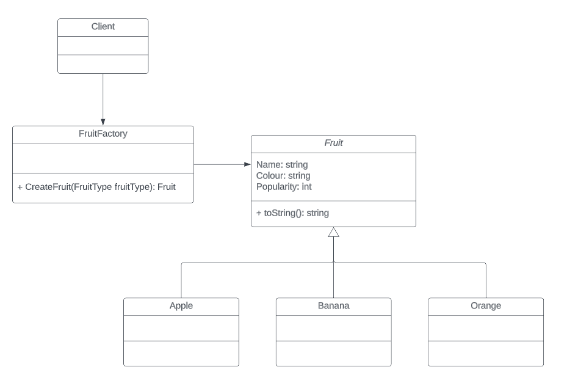

# The Factory Method Pattern
The Factory Method pattern is a creational design pattern which hides the logic required to create objects, providing cleaner code which is easier to maintain.

## Example
In this example a FruitFactory class is used to instantiate different types of fruit. The object creation is hidden from the client, who only uses the factory class to create the objects it needs. In the example, a FruitType enum is used to determine which type of fruit the client is asking for.

## UML
